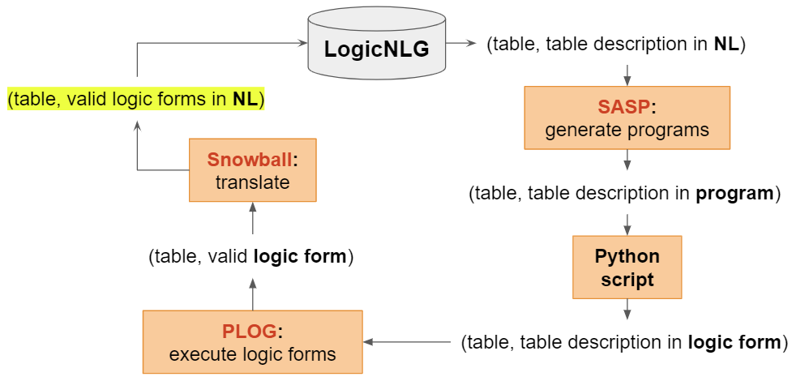
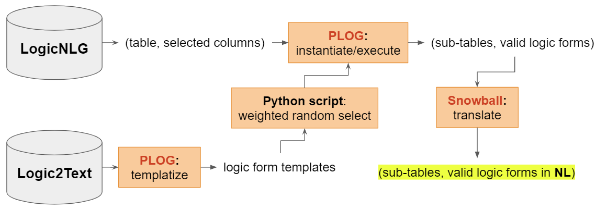

# Prepare LoFT Training and Inference Data

Create a virtual environment and run the following commands to set up the env.
```shell
pip install -r requirements.txt
unzip data.zip
```

## 1. Prepare LoFT Training Data
<p align="center">

</p>

### 1.1 Run SASP
We reproduced [SASP](https://github.com/ousuixin/SASP) to parse each statement in the LogicNLG training set to its corresponding logic form. To run SASP, you need to install [CoreNLP 4.5.2 version](https://stanfordnlp.github.io/CoreNLP/download.html);  download [SASP's model checkpoint](https://drive.google.com/file/d/1TyleYW54hLJp8ZaC13vD33BJQnVPvbnF/view?usp=sharing) and save it as `train/SASP/runs/demo_run/model.best.bin`. 

First go to `train/SASP/table/tabfact`, run
```shell
bash run_processing_logicnlg.sh
```
You need to set the CoreNLP path in `run_processing_logicnlg.sh`.

Then go to `train/SASP`, run

```shell
bash run_sasp.sh
```

### 1.2 Process SASP Results

Go to `train/scripts`, run

```shell
bash run_post_processing_sasp_result.sh
```

## 2. Prepare LoFT Inference Data
<p align="center">

</p>

Go to `inference/scripts`, run

```shell
python run_instantiate.py	
```
It should be noted that we re-implementated the *candidate logic form generation* from [PLOG](https://arxiv.org/abs/2205.12697) paper. The official implementation can be found [here](https://github.com/microsoft/PLOG).

## 3. Post-process LoFT Training and Inference Data

Go to `translate/scripts`, run

```shell
python run_translate.py	
```

It translates logic forms into a more human-readble form, and prepare the training and inference data of LoFT framework. The output files is stored as `train/out/LoFT_train_input.json` and `inference/out/LoFT_inference_input.json`. Copy them to `LoFT/LoFT_framework/processed_LoFT_data`.

## Note:
The overall file structure can be viewed at `file_structure.txt`. The output of each module can be found at [Google Drive](https://drive.google.com/drive/folders/1W9c9pVPDnvdyqAMObwG3uzMJpeM68eUX?usp=sharing).

